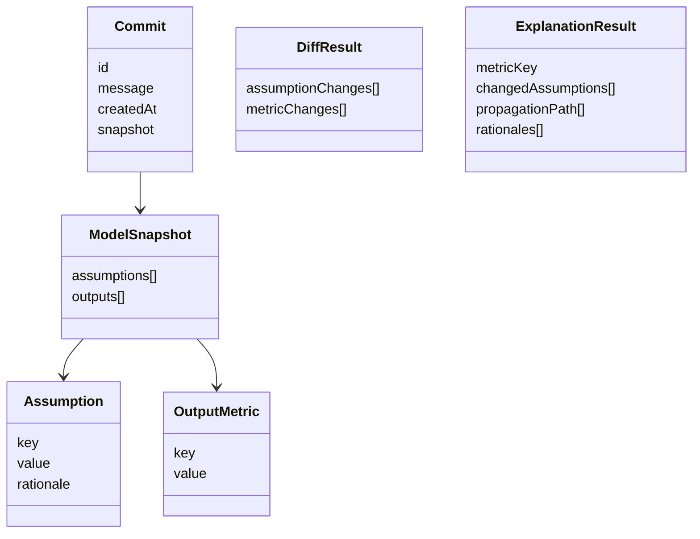
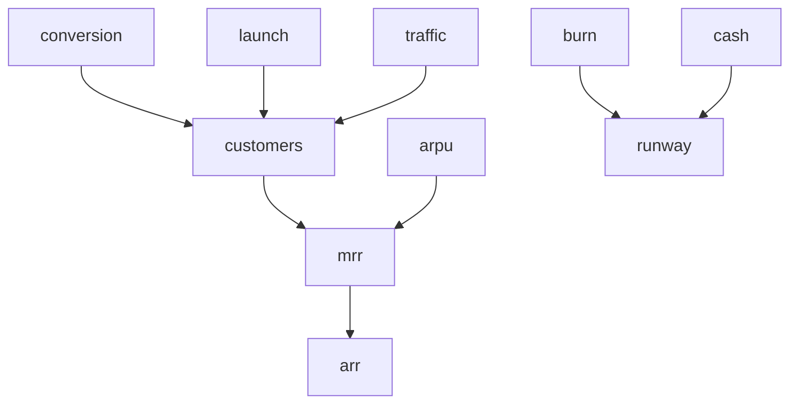
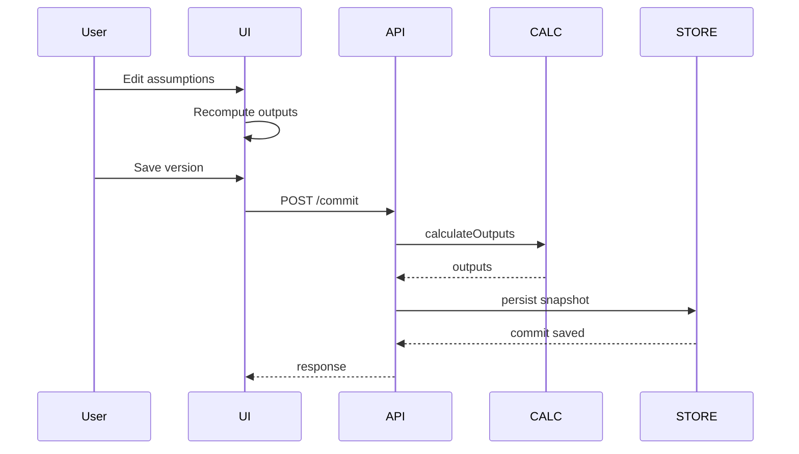
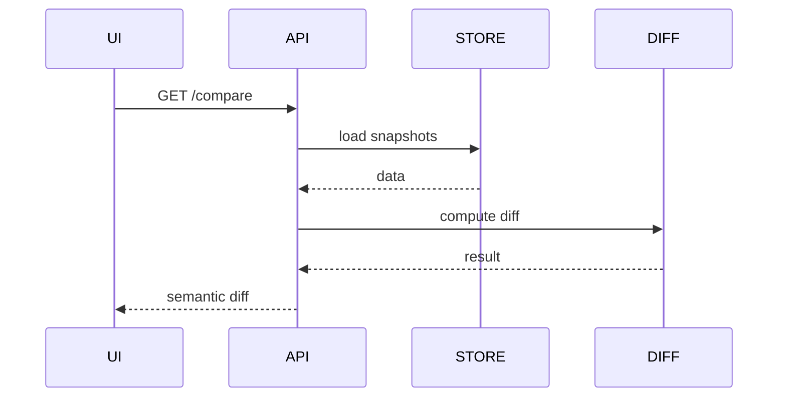
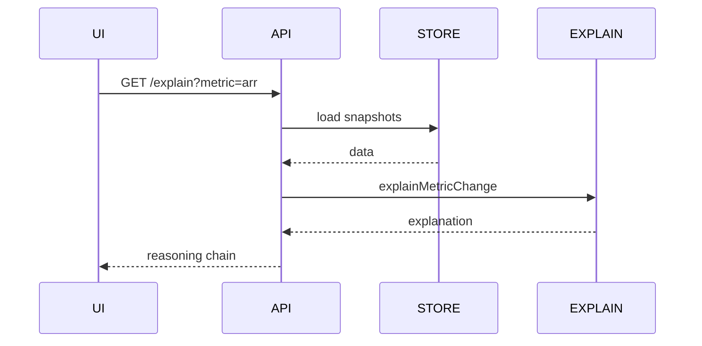
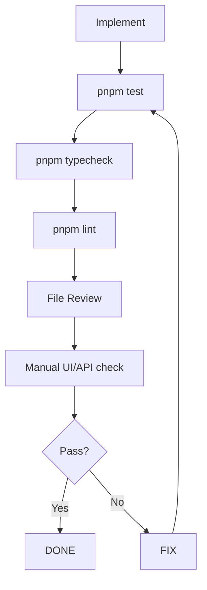
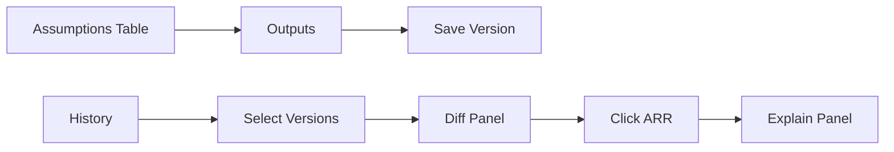
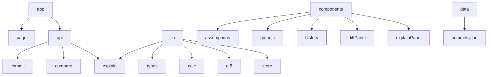

# Finance Memory For Reasoning — Full Architecture (Mermaid + Checklist)

## Index
- **D1** — System architecture
- **D2** — Step-by-step build flow
- **D3** — Core domain model
- **D4** — Calculation dependency graph
- **D5** — Commit / snapshot lifecycle
- **D6** — Compare + diff flow
- **D7** — Explain-why flow
- **D8** — Verification / testing routine
- **D9** — UI interaction architecture
- **D10** — File/module architecture


# D1 — System Architecture

```mermaid
flowchart LR
    UI[Next.js UI<br/>React + Tailwind]
    API[Route Handlers<br/>/app/api/*]
    DOMAIN[Domain Layer<br/>calc diff explain]
    STORE[Store Layer<br/>JSON/In-memory]
    DATA[(commits.json)]

    UI --> API
    UI --> DOMAIN
    API --> DOMAIN
    API --> STORE
    STORE --> DATA
    DOMAIN --> STORE
````

---

# D2 — Step-by-Step Build Flow (with verification)

```mermaid
flowchart TD
    S1[Types] --> V1[Verify]
    V1 --> S2[Seed Model]
    S2 --> V2[Verify]
    V2 --> S3[Calc Engine]
    S3 --> V3[Verify]
    V3 --> S4[UI Assumptions + Outputs]
    S4 --> V4[Verify]
    V4 --> S5[Validation]
    S5 --> V5[Verify]
    V5 --> S6[Store]
    S6 --> V6[Verify]
    V6 --> S7[Commit Flow]
    S7 --> V7[Verify]
    V7 --> S8[History]
    S8 --> V8[Verify]
    V8 --> S9[Diff Engine]
    S9 --> V9[Verify]
    V9 --> S10[Compare UI]
    S10 --> V10[Verify]
    V10 --> S11[Dependency Map]
    S11 --> V11[Verify]
    V11 --> S12[Explain Engine]
    S12 --> V12[Verify]
    V12 --> S13[Explain UI]
    S13 --> V13[Verify End-to-End]
```

---

# D3 — Core Domain Model



---

# D4 — Calculation Dependency Graph



---

# D5 — Commit / Snapshot Lifecycle



---

# D6 — Compare + Diff Flow



---

# D7 — Explain-Why Flow



---

# D8 — Verification / Testing Loop



---

# D9 — UI Interaction Architecture



---

# D10 — File / Module Architecture

